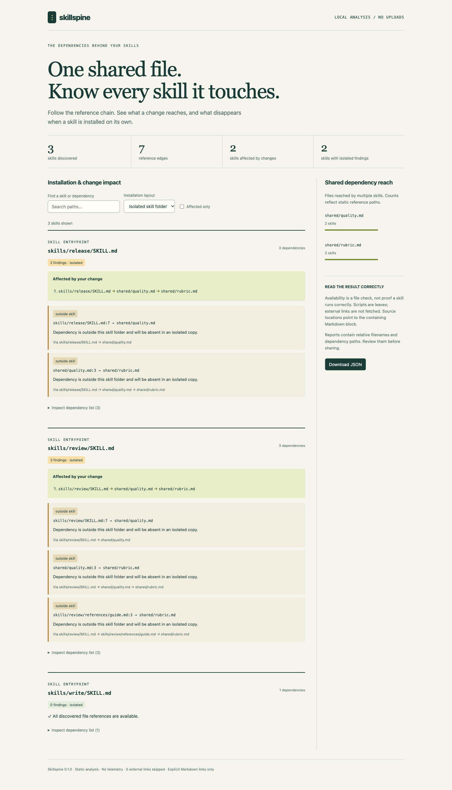

<div align="center">

# ⋮ Skillspine

**See which agent skills a shared-file change affects—and which break when installed alone.**

[](https://github.com/Nithinfgs/skillspine/actions/workflows/ci.yml)
[](https://www.python.org/downloads/)
[](LICENSE)

A local CLI for maintainers of `SKILL.md` collections. No model, server, or API key.

</div>



## Try it in a minute

Requires Python 3.11+ and Git.

```bash
git clone https://github.com/Nithinfgs/skillspine.git
cd skillspine
python3 -m venv .venv
source .venv/bin/activate
python -m pip install .
skillspine examples/collection --changed shared/rubric.md \
  --format html --output skillspine-report.html --fail-on never
```

Open `skillspine-report.html` in your browser. On Windows PowerShell, use `python`
instead of `python3` and `.venv\Scripts\Activate.ps1` to activate the environment.

The example has **three skills**. Changing `shared/rubric.md` affects **two** through
reference chains. Both work inside the collection, but lose dependencies when their
individual folders are copied. Switch the report's installation layout to see the difference.
`--fail-on never` lets this deliberately nonportable example finish with exit code 0.

The [generated demo HTML](docs/demo.html) is also committed; download it and open it
locally. It has working search, layout selection, affected-only filtering, expandable
dependency lists, and JSON download. Reports work offline.

## Why it exists

Shared checklists make skill libraries easier to maintain. They also create hidden
coupling: one rubric can affect several skills, and an installer that copies one
skill folder can leave the rubric behind. These are [reported failure classes](https://github.com/addyosmani/agent-skills/issues/468),
not hypothetical prompt-quality scores.

Skillspine builds a reference graph and answers:

- **What should I review?** Pass changed files and get affected entrypoints with shortest reference chains.
- **What survives installation?** Compare the full collection with a copy of each skill's own folder.
- **What is broken already?** Find missing files, exact-case mismatches, symlinks, excluded targets, and escaping paths.
- **Can I automate this?** Use versioned JSON and predictable exit codes in CI.

It complements [skill-validator](https://github.com/agent-ecosystem/skill-validator)
and [SkillLint](https://github.com/Meet-Miyani/agent-skill-validator). Its focus is
collection-wide change impact and installation boundaries; it does not score prose,
validate frontmatter, repair packages, or claim that a passing skill executes safely.

## Installation

Install from a clone with `python -m pip install .`, as above. For an isolated CLI
installation with [pipx](https://pipx.pypa.io/):

```bash
pipx install 'git+https://github.com/Nithinfgs/skillspine.git@v0.1.0'
```

Skillspine is **not published to PyPI**. Do not assume a same-named PyPI package is this project.
Runtime dependencies are `markdown-it-py` and its transitive dependency `mdurl`.

## Usage

```bash
# Gate on missing/nonportable references when a whole collection is installed.
skillspine ./my-skills --layout collection

# Default: model each skill installed as only its own folder.
skillspine ./my-skills

# Explain impact, including references to a file that was just deleted.
skillspine ./my-skills --changed shared/checklist.md --changed shared/style.md

# Machine-readable graph, findings, dependencies and explanatory paths.
skillspine ./my-skills --format json --output report.json

# Produce a report without failing the command on findings.
skillspine ./my-skills --format html --output report.html --fail-on never

# Opt into heuristic references such as inline `references/guide.md` spans.
skillspine ./my-skills --code-paths
```

Changed paths are **relative to the root you pass**, not your shell's working directory.
Run `skillspine --help` for every option. Existing output files are never overwritten;
choose a new filename or remove your previous report explicitly.

| Exit | Meaning |
|---|---|
| `0` | Selected gate passed; scan completed |
| `1` | Findings in selected layout, or affected skills when using `--fail-on impact` |
| `2` | Invalid input, unreadable files, resource limit, or output error |

`--fail-on never` only disables the finding/impact gate. Incomplete scans still exit 2.
Both installation layouts are always included in JSON and HTML. `--layout` selects
the text view, initial HTML view, and the exit-code gate.

## Configuration

Configuration is explicit, never auto-discovered or executed:

```bash
skillspine ./my-skills --config examples/skillspine.toml
```

```toml
exclude = ["vendor", "generated"]
code_paths = false
max_files = 20000
max_markdown_bytes = 1000000
```

Exclusion globs match an entire collection-relative path or a basename. Matching a
directory excludes its subtree. Defaults skip `.git`, virtual environments,
`node_modules`, caches, and `.env` files. `--exclude` adds to configured patterns;
`--code-paths` enables code-span inference even if the config disables it.
Unknown config keys and invalid types are errors. See [reference semantics](docs/reference.md).

## How it works

```text
collection root
   │
   ├─ bounded file inventory (no symlink traversal)
   ├─ SKILL.md entrypoints
   └─ CommonMark links → local files → more Markdown links
                         │
                         ├─ shortest change-impact paths
                         ├─ collection / isolated-folder checks
                         └─ text · JSON · offline HTML
```

Python dataclasses describe the graph. A breadth-first walk per skill handles cycles
and produces shortest paths. Scripts and assets are terminal nodes. The only writes
are to a report path you explicitly request; Skillspine never modifies skills.

[Technical design](docs/design.md) · [CLI and JSON semantics](docs/reference.md) ·
[Research: 18 repositories and 12 scored ideas](docs/research/README.md)

## Use cases and limits

Use it before publishing a skill collection, reviewing shared guidance changes, or
splitting a plugin into individually installable skills. A skill at the collection
root has the entire root as its isolated folder; pass the actual collection boundary.

Analysis covers explicit Markdown links, images and reference-style links, plus
optional path-like inline code spans. It does **not** infer prose references, shell
commands, Python imports, HTML links, runtime downloads or dynamically constructed
paths. Markdown anchors are not validated. Links resolve relative to the containing
Markdown file. Locations identify the containing block's first line. Heuristic code
paths use that same convention and may need human review.

An isolated finding is a static packaging warning, not a simulation of a specific
installer. Some installers deliberately copy shared files. Repeated references may
produce several findings for one missing dependency. Scan a stable checkout; the
filesystem traversal is not an atomic snapshot or a sandbox against concurrent mutation.
Reports omit source bodies and the absolute scan root, but referenced paths can still
contain sensitive names. Inspect reports before sharing. See [security policy](SECURITY.md).

## Development and contributing

```bash
python -m pip install -e '.[dev]'
python -m pytest --cov=skillspine
ruff check .
ruff format --check .
mypy src
python -m build
pip-audit
```

See [CONTRIBUTING.md](CONTRIBUTING.md) for the test strategy, optional browser checks,
and how to add a new reference rule. CI tests Python 3.11 and 3.14 on Linux plus
Python 3.13 on macOS and Windows.

## Roadmap

- Git-aware comparison with a base revision, including removed reference edges.
- Explicit installer inclusion manifests for more precise packaging checks.
- SARIF and editor diagnostics.
- Opt-in dependency adapters for script imports.

These are future work, not current capabilities. v0.1 intentionally stays a small,
read-only utility. Feedback with a minimal skill tree is especially useful.

## License

[MIT](LICENSE). Original code and example skills. Third-party projects are cited for
research and comparison; their code is not bundled.
